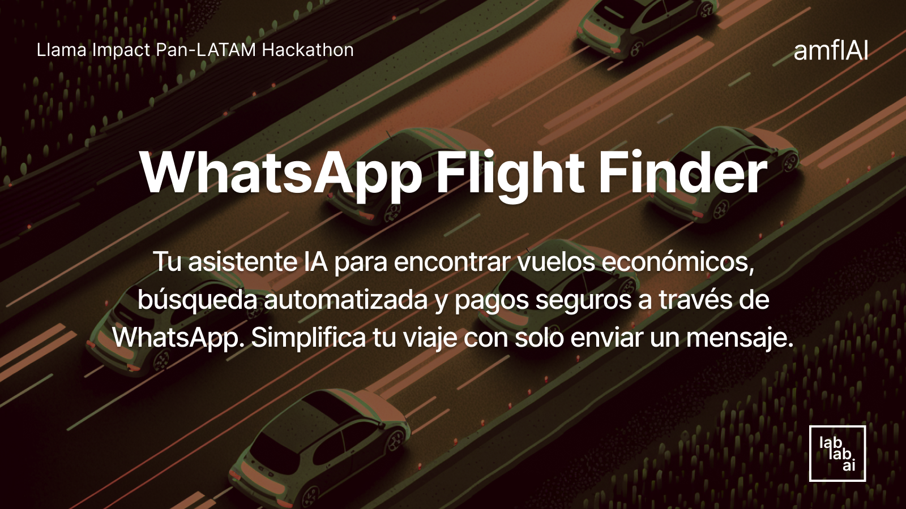

# WhatsApp Flight Finder AI 🛫



Sistema automatizado que encuentra los vuelos más económicos mediante IA y WhatsApp.
Integra búsqueda de precios, pagos seguros con Bold y comunicación directa por WhatsApp.
Simplifica la experiencia de compra de vuelos para usuarios latinoamericanos.

## MIRA EL VIDEO DE LO QUE HACEMOS
- https://www.loom.com/share/13a35675bad84322bdd410d8d6caf7a0?sid=36bd306a-0986-47a9-8424-bf96873ef34a
- Asesor De Ventas y Toools para Agencias de Viajes 🛫 - Watch Video
[Ver video en Loom](https://www.loom.com/embed/13a35675bad84322bdd410d8d6caf7a0?sid=8a13ffa9-0415-44cf-a9d2-5164691cc5d8)


## 🚀 Características

- Búsqueda automatizada de vuelos usando IA
- Integración con WhatsApp para comunicación con usuarios
- Procesamiento de pagos seguro a través de Bold
- Búsqueda de precios en tiempo real con SerpAPI
- Sistema de paquetes turísticos integrado

## 📋 Prerrequisitos

- Python 3.8+
- Una cuenta de Bold para procesamiento de pagos
- API key de SerpAPI
- Cuenta de WhatsApp Business API

## 🔧 Edita el archivo `.env` con tus credenciales:

```
BOLD_API_KEY=tu_api_key_bold
SERPAPI_KEY=tu_api_key_serpapi
WHATSAPP_TOKEN=tu_token_whatsapp
```

## 📝 Uso

1. Envía un mensaje al número de WhatsApp configurado
2. Especifica tu búsqueda de vuelo (origen, destino, fechas)
3. El bot buscará las mejores opciones disponibles
4. Selecciona tu vuelo y procede al pago seguro
5. Recibirás tu confirmación por WhatsApp

## 🤝 Contribuciones

Las contribuciones son bienvenidas. Por favor, abre un issue primero para discutir los cambios que te gustaría realizar.

## 📄 Licencia

Este proyecto está bajo la Licencia MIT - ver el archivo [LICENSE.md](LICENSE.md) para más detalles.

## ✨ Agradecimientos

- Bold por la integración de pagos
- SerpAPI por el acceso a datos de vuelos
- WhatsApp Business API por la plataforma de mensajería

---

Desarrollado con ❤️ para el Llama Impact Pan-LATAM Hackathon
